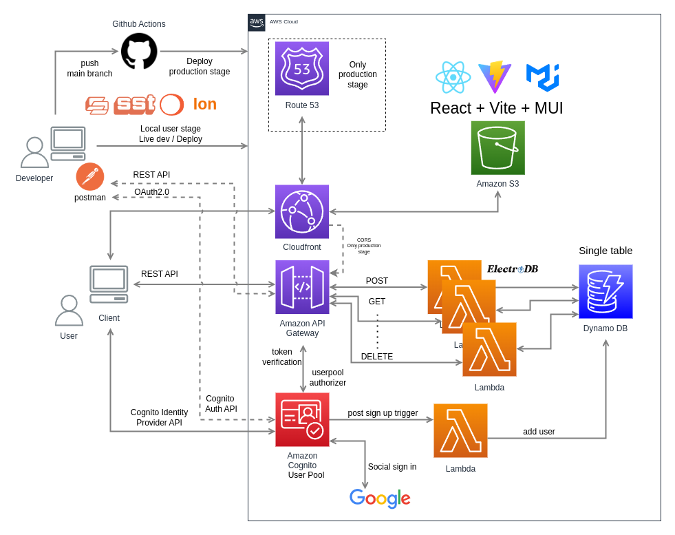

# Serverless Todo Application with SST

This is a serverless Todo application built using SST ion, organized as a monorepo.

## Software architecture

- **Authentication**: Integrated with AWS Cognito for user authentication.
- **Backend**: Utilizes AWS Lambda for serverless functions and DynamoDB for data storage.
- **Frontend**: Built with React and uses Vite for fast development and optimized builds.

## License

This project is licensed under the MIT License - see the LICENSE file for details.
